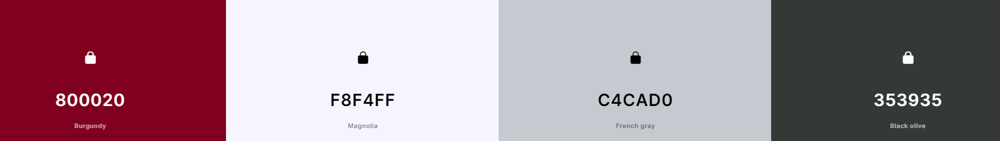
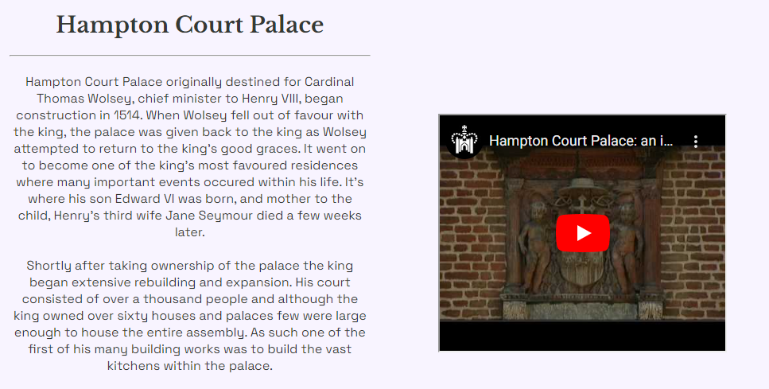
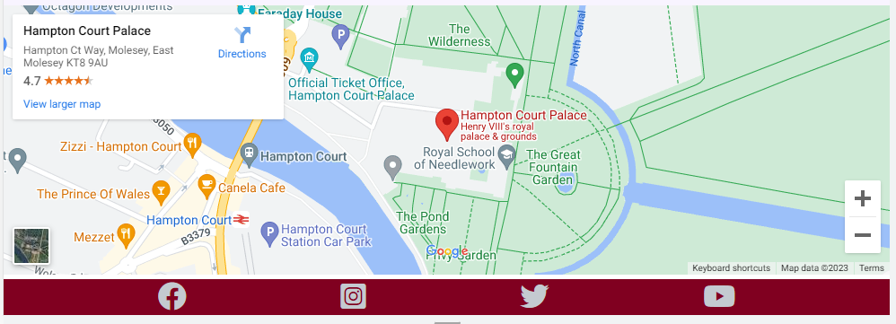
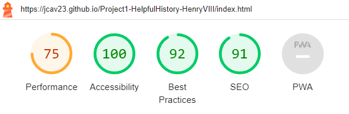
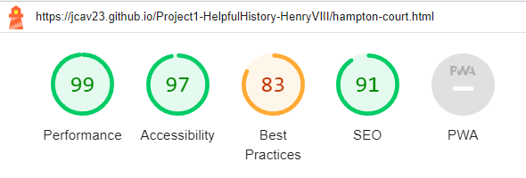
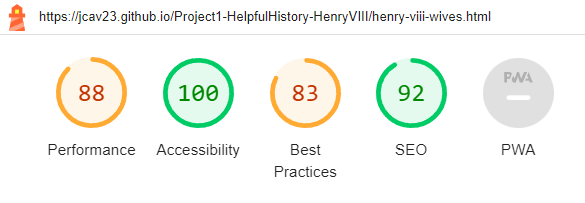
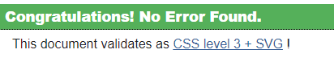

# Helpful History

Helpful History is designed to be a friendly and informative series of websites each dedicated to providing a source of informative and interesting information about key historical figures. This project is the first entry in the series and is focused on one of the most memorable rulers in the English monarchy, Henry VIII. 

The site aims to provide information to people of all ages about some of the most famous aspects of his life including his six wives, and his life at Hampton Court Palace. Also included is a feedback page where users are able to leave reviews of the site and suggest any improvements or make requests on who they would like to see in future entries.

## UX

### Site Purpose:
To provide an informative and educational website about a specific historical figure to the people visiting the page, In this instance, Henry VIII.

### Site Goal:
To provide accurate and interesting information that is easily accessible for anyone wishing to learn more about this specific historical figure. To provide a positive experience to the user so that enough interest is generated to maintain a series.

### Audience:
Anyone with an interest in historical knowledge while being accessible for most ages without being too academic to alienate more casual visitors. 

### Communication:
With a bold colour theme, appropriate font styling and images depicting historical artwork the entire site is designed to maintain an appropriate historical theme while still being a modernised web based interpretation to generate a positve user experience. All information is clearly written and accesible for users.

## Design

### Colours:
The burgundy colour was chosen as a nice thematically appropriate colour, with the contrasting colours then chosen to provide a balace across the website coupled with the artwork imagery to be eye catching and attractive without being overwhelming. The French grey colour provides a nice contrast for the header nav and footer links while the darker olive colour provides a nice dark contract to the magnolia background for the text to appear clear and readable.

### Fonts:
The Font's chosen were Libre Baskeville and Space Grotesk, libre baskeville provided a nice thematically appropriate design for the headings while space grotesk applied a more modernised font appropriate for a website while still making the text attractive.

### Images:
Most images were comprised of historical artwork of the king and his family. This provided a excellent historical theme while still being extremely eyecatching and generating a positive experience with the benefit of being within the public domain. 

## Features 

### Existing Features

#### Navigation Bar

  - Featured on all four pages of the site, the navigation bar is a fully responsive dropdown menu including links the Home, Life at Hampton Court, Wives of Henry VIII, and Feedback pages.
  - Position of the navigation link elements changes from vertically to horizontally on larger screens to keep the display visually appealing on larger screens while still retaining the dropdown function.
  - This will allow the user to navigate easily between different pages on the site without having to revert to a previous page using the back button.
  
#### Mobile Nav Bar
  

#### Desktop Nav Bar (Open)

#### Desktop Nav Bar (Closed)

### Landing Page

#### Hero Image

  - The landing includes an image of artwork depicting Henry VIII with title text overlay to provide and eye-catching display while clearly defining what the website is focused on. 
  - This section introduces the user to Helpful History: Henry VIII with an eye catching piece of artwork to grab their attention

- __About Us__

  - The About Us section will welcome the user and explain the concept of Helpful History, introduce this first entry explaining the focus and structure of the website.
  - This should clearly convey the core information of the website and provide the user any direction needed to what they can hope to find on the website.
  - This section also contains the contents of the other content pages outlining the information in each section with navigation elements in each heading. 

- __Footer__ 

  - The footer section includes social media links to each of the four main social media platforms. The links will open to a new tab to allow easy navigation for the user. 
  - The footer is valuable to the user as it encourages them to keep connected via social media and keep up to date about future releases.
  - The footer is available across all pages on the site to maintain the theming and style across the website. 

#### Life at Hampton Court

  - This page features an offical video from the Historic Royal Palaces, an independant chairty that manages some of the UK's unoccupied Palaces. This will provide the user with a piece informative and entertaining media to give them an enjoyable experience visiting the site. 
  - This section also contains some text content providing more detail about the king's life at the palace so that the site is still informative should the user be unable/not wish to use the video player.

#### Map
  - This page also contains a map location of Hampton Court Palace should any of the users be interested in visiting the area.

#### Wives of Henry VIII

  - The gallery will provide the user with supporting images to see what the meet ups look like. 
  - This section is valuable to the user as they will be able to easily identify the types of events the organisation puts together. 

For some/all of your features, you may choose to reference the specific project files that implement them.

In addition, you may also use this section to discuss plans for additional features to be implemented in the future:

### Features Left to Implement

- In future releases in the series it would be good to implement some interactivity on the site, such as an interactive timeline of events.

## Testing 

Most bugs were dealt with during development as outlined in the Git Commit logs, most bugs were attributed to misspellings and fixed accordingly, this included the social media links styled incorrectly on the Wives page. 

Another such bug was found where the feedback form was not accepting values in the name input sections. This was attributed to an oversight when writing the code and the Name attribute had been accidently omitted, however this was acknowldged and adjusted. Similarly, the 'Email' name attribute when added had the same value as the 'Name' input name atrribute, however this was later spotted and fixed.. The form was then tested successfully validating email inputs, and returned a successful form dump.

The responsiveness of the website was tested during development and the various flex styles were decided upon during extensive trial and error when deciding how to layout the website. The website is attractive and functional on mobile and has been tested by opening in Safari on mobile.

All links open successfully to correct pages and in new tabs when appropriate on the deployed page.

All pages generated positive Accessibility reports within Lighthouse, all achieving a score of 90+

### Validator Testing 

The HTML and CSS code were passed through the official W3C and Jigsaw Validators respectively and the results are outlined below

- HTML
  - Landing Page
    - __NOTE:__ One warning was returned due to the H1 element being located within a div on landing page, I have chosen to keep this as it is for stylization purposes and still serve its intended purpose as a top level heading.
  - Wives Page
    - Passed with no errors
  - Hampton Court Page
    - Returned error due to frameborder property being deprecated, the error was then removed accordingly.
    - Returned error due to using a percentage value for width within the two iframe's as this was the same technique demonstrated within the Coder's Coffeehouse example I believed it to be acceptable.
  - Feedback
    - Returned error due to the rows attribute was incorrectly spelt, this was changed appropriately and code passed without error. 

  
  - [W3C validator](https://validator.w3.org/nu/?doc=https%3A%2F%2Fcode-institute-org.github.io%2Flove-running-2.0%2Findex.html)
  

- CSS
  - Stylesheet returned no error when passed through the official [(Jigsaw) validator](https://jigsaw.w3.org/css-validator/validator?uri=https%3A%2F%2Fvalidator.w3.org%2Fnu%2F%3Fdoc%3Dhttps%253A%252F%252Fcode-institute-org.github.io%252Flove-running-2.0%252Findex.html&profile=css3svg&usermedium=all&warning=1&vextwarning=&lang=en#css)
  

### Unfixed Bugs

## Deployment
- The site was deployed to GitHub pages. The steps to deploy are as follows: 
  - In the GitHub repository, navigate to the Settings tab 
  - From the source section drop-down menu, select the Master Branch
  - Once the master branch has been selected, the page will be automatically refreshed with a detailed ribbon display to indicate the successful deployment. 

The live link can be found here - https://jcav23.github.io/Project1-HelpfulHistory-HenryVIII/index.html 

## Credits 

The general structure and certain elements were inspired by the workable examples found within the course content such as Love Running, and Coder's Coffeehouse but expanded and implemented slightly different to demonstrate my understand of the techniques. W3 schools was also used extensively to reference various rules, attributes, properties and syntax.

### Content 

- Much of the information was gathered from [History.com](https://www.history.com/news/henry-viii-wives)
- Information was also gathered from the wikipedia pages for Henry VIII and Hampton Court Palace 
- The Maps Iframe was taken from the Google Maps Embeded API found with the Google Maps Platform [documentation](https://developers.google.com/maps)
- The icons in the footer were taken from [Font Awesome](https://fontawesome.com/)
- The Fonts were taken from [Google Fonts](https://fonts.google.com/)

### Media

- The portraits of Henry's Wives were taken from [History.com](https://www.history.com/news/henry-viii-wives)
- The image of the Tudor Rose was retrieved from Wikipedia generated by Wikimedia commons user [Sodacan](https://commons.wikimedia.org/wiki/User:Sodacan)
- The Video was created by Historic Royal Palaces and was accesed from Youtube. However this project is intended for educational purposes only and not designed for profit. 
- The hero image was retrieved from Wikipedia and depicts the 16th Century painting The Family of Henry VIII and is in the public domain
- The portrait of Henry VIII on the feedback page was retrieved from Wikipedia and again is in the public domain.
